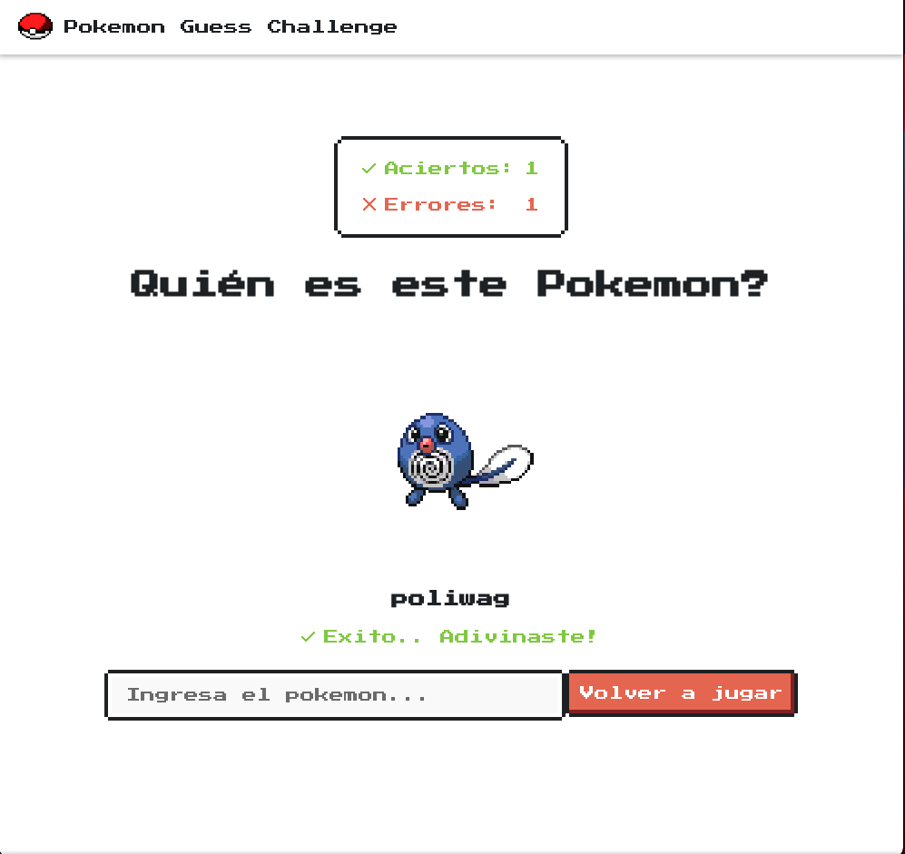

# Adivinar el Pokemon

## Resolución del challenge propuesto por [Goncy](https://github.com/goncy/interview-challenges/tree/main/guess-pokemon)

Hecho en React + Typescript + Vite.js

## Deploy en [Vercel](https://vercel.com)

[Link al demo](https://challenge-guess-pokemon-iguerra.vercel.app)

### Para correr el proyecto

- npm install
- npm run dev